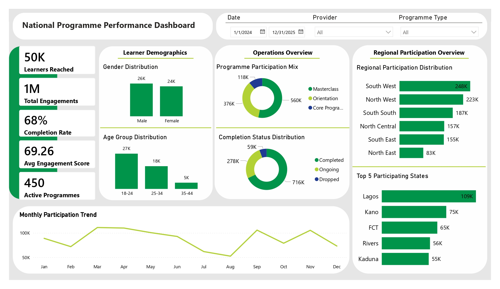
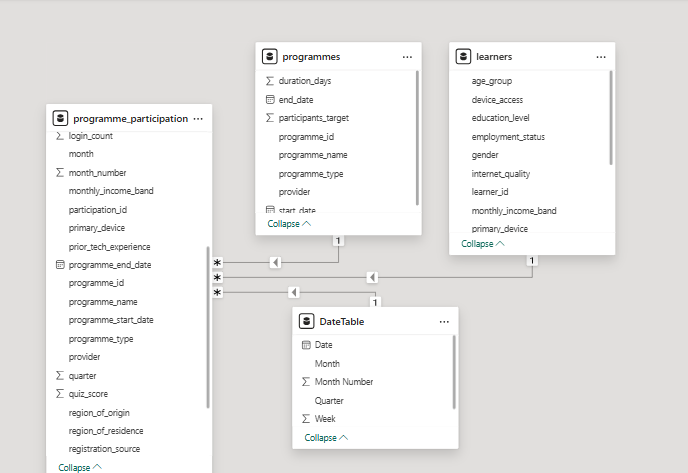

<h1 align="center">National Programme Operations Dashboard</h1>

Operational analytics dashboard built in Power BI using a simulated national programme dataset generated with Python.

  

 

---

<h2>Project Overview</h2>

This project simulates a national programme operations reporting environment designed for monitoring learner participation, engagement, programme delivery, and regional performance across large-scale digital learning initiatives.

The solution combines Python-generated operational datasets with Power BI reporting workflows to model executive-level monitoring and evaluation systems used in programme operations and decision support environments.

---

<h2>Data Model</h2>

  

---

<h2>Key Features</h2>

<h3>Executive KPI Monitoring</h3>

<ul>
  <li>Learners Reached</li>
  <li>Programme Engagements</li>
  <li>Programme Completion Rate</li>
  <li>Average Engagement Score</li>
  <li>Active Programmes</li>
</ul>

<h3>Operational Monitoring</h3>

<ul>
  <li>Monthly Participation Trend Analysis</li>
  <li>Programme Participation Mix</li>
  <li>Completion Status Distribution</li>
  <li>Regional Participation Analysis</li>
  <li>Top Participating States</li>
</ul>

<h3>Learner Insights</h3>

<ul>
  <li>Gender Distribution</li>
  <li>Age Group Distribution</li>
  <li>Demographic Participation Analysis</li>
</ul>

<h3>Interactive Filtering</h3>

<ul>
  <li>Date</li>
  <li>Provider</li>
  <li>Programme Type</li>
</ul>

---

<h2>Dataset Structure</h2>

The dataset was generated programmatically in Python and structured into a multi-table relational model consisting of:

<ul>
  <li><strong>Learners Table</strong> — demographic and learner profile information</li>
  <li><strong>Programmes Table</strong> — programme operational metadata and scheduling information</li>
  <li><strong>Programme Participation Table</strong> — transactional participation, engagement, and completion records</li>
</ul>

The final dataset simulates over 1 million participation records across multiple programme categories, providers, and operational dimensions.

---

<h2>Analytical Themes</h2>

<ul>
  <li>Programme Operations</li>
  <li>Learner Engagement</li>
  <li>Participation Trends</li>
  <li>Regional Performance</li>
  <li>Monitoring & Evaluation</li>
  <li>Operational Reporting</li>
</ul>

---

<h2>Potential Extended Analysis</h2>

<ul>
  <li>Learner retention analysis</li>
  <li>Cohort participation analysis</li>
  <li>Provider performance benchmarking</li>
  <li>Programme completion forecasting</li>
  <li>Regional engagement comparisons</li>
  <li>Attendance and assessment correlation analysis</li>
  <li>Dropout risk prediction modelling</li>
  <li>Operational capacity planning</li>
  <li>Time-series participation forecasting</li>
  <li>Programme effectiveness scoring</li>
</ul>

---

<h2>Notes</h2>

The full participation dataset was excluded from the repository due to file size limitations.

---

<h2>Author</h2>

<strong>Efe Godson Akpobasa</strong>

Data Analytics & Engineering | Programme Operations, Commercial & Marketing Intelligence | SQL, Power BI, Python

